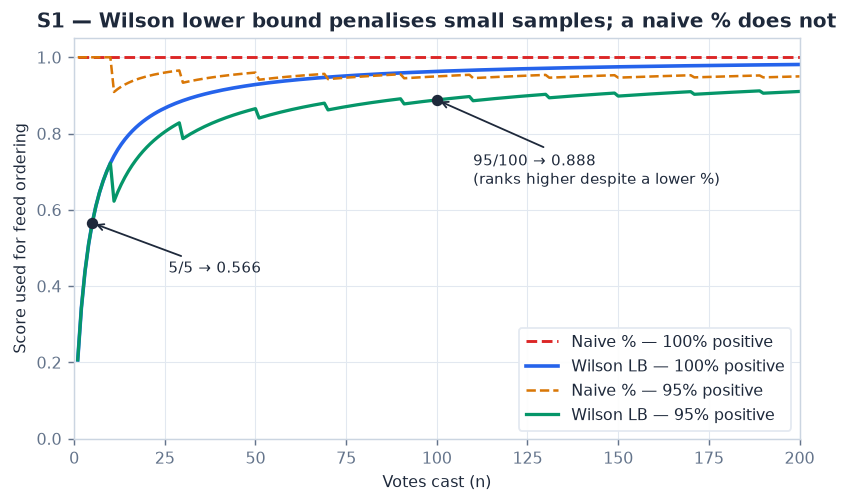
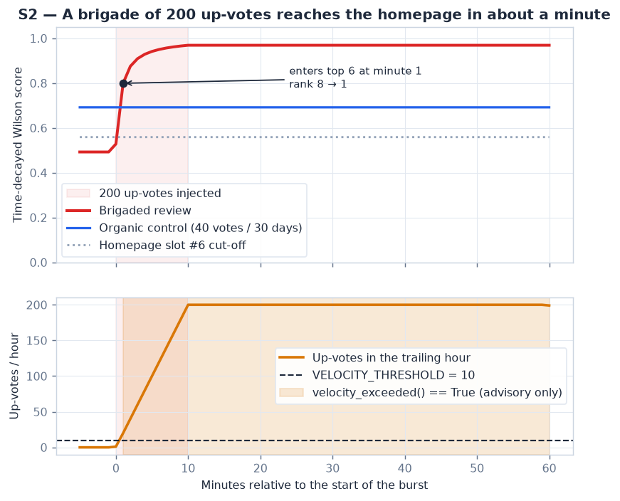
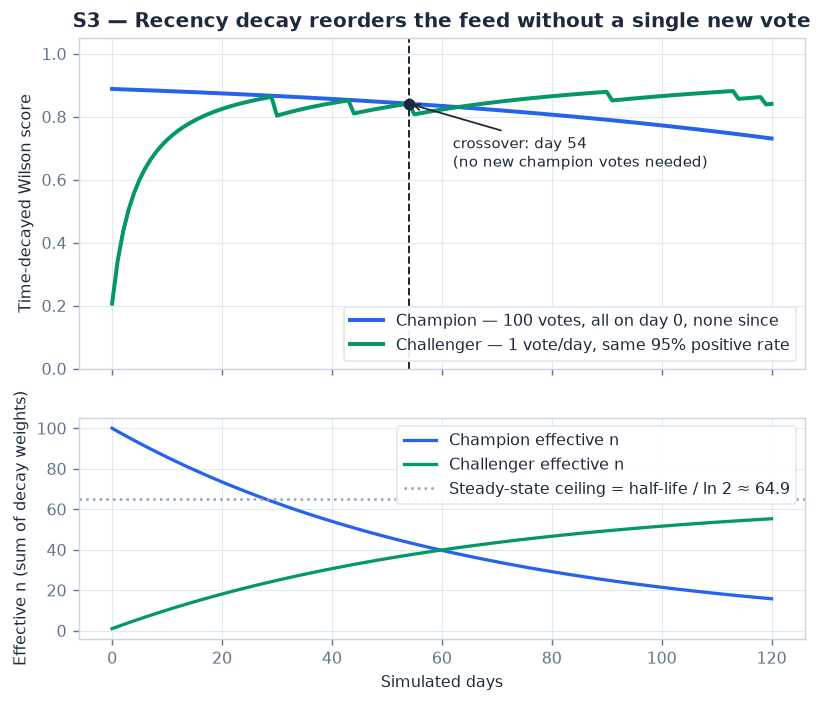
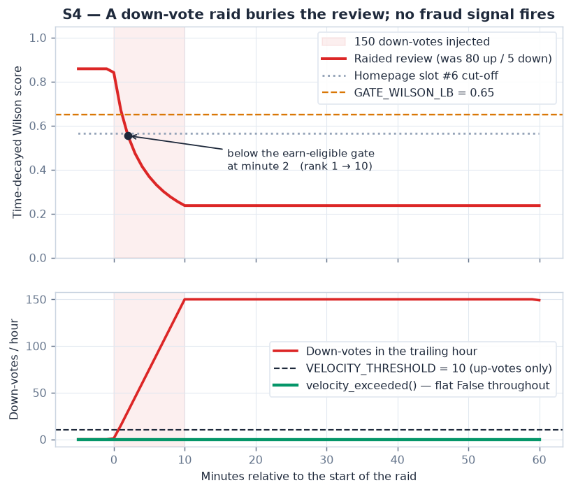

# Ranking Algorithm Simulation

How the Wilson score interval, recency decay, and the velocity fraud signal behave
under realistic vote influxes — and what each one does to what a visitor actually
sees on bluntly.ph.

- **Algorithms under test:** `backend/app/services/ranking.py` (parameters pinned in
  [ADR-004](adr/004-wilson-decay-velocity-reciprocity.md))
- **Simulation source:** `backend/sim/`
- **Assertions:** `backend/tests/test_ranking_simulation.py` (19 tests)
- **Reproduce:** `cd backend && python -m sim`

Every number quoted below is computed by `sim.scenarios.headline_facts()` and asserted
in the test suite. Nothing here is hand-written arithmetic.

---

## How a vote reaches the website

The simulation reproduces this path:

| Step | Code |
|---|---|
| Vote written (rejects self-votes and votes on unpublished reviews) | `vote_service.cast_vote` |
| Score recomputed in the same transaction | `vote_service.recompute_review_vote_aggregates` → `reviews.wilson_score` |
| Author trust refreshed | `trust_service.recompute_user_trust` |
| Decay re-applied nightly | `vote_service.recompute_all_wilson_scores` |
| Feed ordered | `review_service.list_feed` → `ORDER BY wilson_score DESC, created_at DESC` |
| Homepage strip | `lib/reviews.ts` → `/api/v1/reviews/feed?sort=wilson&limit=6` |

So a vote influx decides **which six reviews the homepage shows**. That is the unit of
impact used throughout this document: a scenario "reaches the homepage" when its rank
among a synthetic field of nine organic reviews rises to 6 or better.

---

## S1 — Why Wilson, and not a percentage



A naive positive percentage is flat: one up-vote and two hundred up-votes both score
100%. The Wilson lower bound asks a different question — *given this evidence, what is
the worst plausible true rate at 95% confidence?* — so it has to be earned.

| Evidence | Naive % | Wilson LB |
|---|---|---|
| 1 / 1 | 100% | **0.2065** |
| 5 / 5 | 100% | **0.5655** |
| 95 / 100 | 95% | **0.8882** |
| 200 / 200 | 100% | **0.9812** |

**What the website does.** A brand-new review with one perfect vote scores 0.2065 and
cannot displace anything. A 95/100 review outranks a 5/5 review despite the lower raw
percentage. This is the single property that stops the feed being dominated by whoever
posted most recently and got a friend to up-vote.

The sawtooth on the 95% curve is real, not noise: `round(n × 0.95)` steps in whole
votes, so the achievable rate oscillates slightly around 95% as n grows.

---

## S2 — Brigade: 200 up-votes in 10 minutes



A review with a thin organic history (12 votes over 20 days) receives 200 up-votes
inside a 10-minute window. An organic control review (40 votes over 30 days, 85%
positive) sits alongside it.

| | Before | After |
|---|---|---|
| Wilson score | 0.4926 | **0.9689** |
| Rank in the field | 8th | **1st** |
| Up-votes in trailing hour | 0 | 200 |
| `velocity_exceeded()` | False | **True** |

**What the website does.** The brigaded review crosses into the top six **at minute 1**
and holds first place for the rest of the hour. `velocity_exceeded()` fires at the same
minute — 200 up-votes per hour against a threshold of 10.

**And then nothing happens.** The flag is advisory by design (ADR-004, capstone FR-8:
signals never auto-block). But it is worse than advisory here — see Finding F1 below.
The flag is never computed for this review at all.

---

## S3 — Decay: the feed reorders with no new votes



A champion review collects 100 votes on day 0 and never receives another. A challenger
collects one vote per day. **Both sit at the same 95% positive rate**, so nothing
separates them except how recent their evidence is.

| Day | Champion effective n | Champion score | Challenger effective n | Challenger score |
|---|---|---|---|---|
| 0 | 100.00 | 0.8882 | 1.00 | 0.2065 |
| 54 | 43.53 | 0.8415 | 37.38 | 0.8415 — **crossover** |
| 120 | 15.75 | 0.7310 | 55.28 | 0.8409 |

The champion's effective n decays as `100 × 0.5^(t/45)`. The challenger's converges
toward the steady-state ceiling `half-life / ln 2 ≈ 64.9` — a review voted on once a
day can never bank more than that, no matter how long it runs.

Note the crossover happens while the challenger still has *less* effective evidence
(37.38 against 43.53). Both reviews target a 95% positive rate, but `round(n × 0.95)`
lands differently on each vote history and the decay weights fall on different votes, so
the challenger's decayed positive fraction is fractionally higher at that moment. The
scores cross before the effective-n curves do (those cross near day 60, visible in the
lower panel). This is ordinary sampling texture, not a modelling artefact — it is what
two genuinely comparable reviews look like.

**What the website does — and the catch.** The crossover at **day 54** only reaches the
site if something recomputes the champion's score. Nothing does: `wilson_score` is
written by `recompute_review_vote_aggregates`, which only runs when *that review*
receives a vote. A review with no new votes keeps its day-0 score forever.

`vote_service.recompute_all_wilson_scores` — the nightly sweep — is the only thing that
re-applies decay to a quiet review. **It is load-bearing, not housekeeping.** If that
job stops, the homepage silently freezes into whatever was popular the day the votes
came in, and no error is raised anywhere.

---

## S4 — Down-vote raid: 150 down-votes in 10 minutes



A healthy review (80 up / 5 down, accumulated over 30 days) is targeted by 150
down-votes inside 10 minutes.

| | Before | After |
|---|---|---|
| Wilson score | 0.8583 | **0.2365** |
| Rank in the field | 1st | **10th (last)** |
| Below `GATE_WILSON_LB` (0.65) | no | **yes, at minute 2** |
| Down-votes in trailing hour | 0 | 150 |
| `velocity_exceeded()` | False | **False** |

**What the website does.** The review leaves the homepage entirely and falls below the
0.65 earn-eligible gate — so beyond losing visibility it also loses monetization
eligibility. The whole thing takes two minutes.

**Nothing detects it.** See Finding F2.

---

## Findings

Both were traced in the code and are demonstrated by the simulation. **Neither is fixed
in this work.** Each has a test asserting current behaviour, so if either is fixed later
the suite fails and this document must be updated alongside it.

### F1 — Fraud signals are unreachable for reviews that have votes

`fraud_service.compute_signals` — which computes the `velocity` and `collusion` flags —
has exactly one caller: `_queue_item` in `admin_referral.py`, building moderator queue
cards. `referral_service.get_queue` returns two lists:

- **pending** — filtered on `published_at IS NULL`
- **edited** — monetized reviews edited since their referral link was issued (published)

Meanwhile `vote_service._votable_or_404` raises 404 unless `published_at IS NOT NULL`.

**A pending review cannot hold a single vote.** So every pending queue card reports
`velocity: false` and `collusion: false` unconditionally, no matter what is happening in
the vote table. Only the much narrower *monetized-but-edited* branch can ever surface a
real vote-based signal — and a moderator has no reason to be looking there during a
brigade.

The S2 brigade produces a review that `compute_signals` flags `velocity: True` when
called directly, and that never appears in the pending queue where that call is made.
Both halves are asserted in `test_fraud_signals_are_unreachable_for_a_voted_review` and
`test_votes_are_rejected_on_unpublished_reviews`.

*Recommendation (not implemented):* compute vote-based signals for published reviews and
surface them somewhere a moderator sees during an active brigade.

### F2 — Velocity detection is up-vote-only

`fraud_service._velocity_flag` filters `ReviewVote.vote == VoteDirection.up`. Down-votes
never enter the sliding window, so a coordinated raid trips no signal at any volume —
150 down-votes per hour against a threshold of 10 registers as zero.

Asserted in `test_s4_no_velocity_signal_fires_during_a_downvote_raid`.

*Recommendation (not implemented):* a symmetric down-vote velocity signal. The existing
`ranking.velocity_exceeded` needs no change — it is direction-agnostic; only the caller's
filter would.

---

## Test coverage

`backend/tests/test_ranking_simulation.py`, 19 tests.

**Pure-math (16, run anywhere).** Every claim above: the 5/5 vs 95/100 rank flip;
Wilson monotonic in n and never above the naive rate; the brigade overtaking the
control and entering the top six inside the burst window; the velocity flag firing on
the burst but not on organic traffic; the day-54 crossover; champion effective n
matching `n × 0.5^(t/half-life)` to 1e-9; the challenger converging below `half-life /
ln 2`; the raid crossing the gate and leaving the homepage; no velocity flag during the
raid; and determinism, since the figures are committed to git.

**End-to-end (3, `@requires_db`).** These prove the feed genuinely reorders, running the
real `cast_vote` → `recompute_review_vote_aggregates` → `list_feed` path. A 41-vote
influx flips the order of two reviews on the same product.

They are **rollback-isolated**: each opens its own connection-level transaction with
`join_transaction_mode="create_savepoint"`, so the service layer's internal `db.commit()`
releases a savepoint rather than committing, and the whole transaction is rolled back in
a `finally`. Nothing is ever persisted, which makes them safe to run against the
production Supabase configuration. Verified after the first run: zero rows matching
`usr_sim_%`, `prd_sim_%`, or `rev_sim_%` remained.

The trade-off: they assert through the service layer rather than an HTTP call, because
the API opens its own session and would not see uncommitted rows. The ordering logic
being asserted is the same line either way.

---

## Reproducing

```bash
cd backend
pip install -r requirements-dev.txt     # adds matplotlib
python -m sim                           # regenerates every figure + CSV, prints the facts
python -m pytest tests/test_ranking_simulation.py -q
```

`python -m sim` is deterministic (seeded at 42) and idempotent — re-running overwrites
the figures with identical bytes, so unrelated commits never show image churn.

**Outputs**

- `docs/assets/ranking/*.png` — the four figures above
- `docs/assets/ranking/data/*.csv` — per-scenario tidy data (`s1_small_n`,
  `s2_brigade`, `s3_decay`, `s4_raid`) for independent analysis

## Scope

This measures ranking behaviour at the **current ADR-004 parameter values**. Retuning
them is an M4→M5 decision with real vote-volume data, per that ADR's own consequences
section. Trust-stage progression, payouts, and the earn-eligible gate beyond its
threshold line in S4 are out of scope, as is performance — see
[LOADTEST_RESULTS.md](LOADTEST_RESULTS.md).
