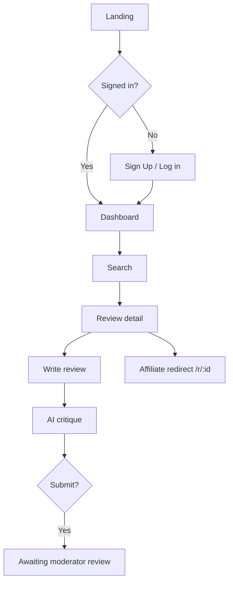

# Product Requirements Document (PRD): Bluntly.ph Frontend

**Project:** Bluntly.ph Frontend
**Date:** 2026-07-20
**Version:** 0.1
**Owner:** Bluntly.ph frontend track
**Status:** Draft
**BRD:** N/A (frontend track; product-level requirements live in the capstone PRD [`../01-bluntly-ph-PRD.md`](../01-bluntly-ph-PRD.md))

---

> **Scope note.** This PRD covers the **Next.js frontend** of Bluntly.ph only. The backend
> (FastAPI, built through M3) is a fixed dependency reached through the documented API
> contract in [`../FRONTEND_INTEGRATION.md`](../FRONTEND_INTEGRATION.md) and
> [`../openapi.json`](../openapi.json). Product behavior owned by the backend (ranking math,
> moderation gates, fraud signals, revenue splits) is referenced here as a contract, not
> redefined. Where a screen needs a backend endpoint that does not yet exist, this PRD says
> so explicitly in §8.

---

## 1. Product Purpose & Value Proposition

Bluntly.ph is a verified product and seller review platform for Filipino online shoppers.
The frontend is the entire experience shoppers, reviewers, sellers, and moderators touch:
a responsive web app (mobile-first, with a full desktop layout) that lets people read
trustworthy reviews, write structured reviews with an AI critique assist, evaluate sellers,
vote and report, follow affiliate links, and participate in the token economy (request
board, earnings, payouts, membership tiers). It turns the backend's trust and incentive
machinery into screens that a first-time visitor can use in minutes.

## 2. Target Personas

Roles are inherited from the capstone PRD ([`../01-bluntly-ph-PRD.md`](../01-bluntly-ph-PRD.md) §3);
they are not re-derived here. The frontend serves four:

**Primary; Online Shopper / Reviewer**
- *Who they are:* Filipino online shopper aged 18+ who uses Shopee/Lazada and wants to know if a product and seller are trustworthy before buying.
- *Their core frustration:* Marketplace reviews are unverified, gamed, and shallow; research means opening 6 to 7 tabs.
- *What success looks like:* Reads a verified, structured review in one place; writes their own with an AI critique nudge; earns from honest contributions.

**Secondary; Seller**
- *Who they are:* A merchant with a claimed or unclaimed seller profile.
- *Their core frustration:* No structured, fair channel to see and respond to buyer feedback.

**Secondary; Platform Administrator / Moderator**
- *Who they are:* Operates the review queue, attaches affiliate links, manages tokens and payouts.
- *Their core frustration:* Needs an efficient admin surface; the moderator queue is a known slow screen on the backend and must be paginated carefully.

**Tertiary; Visitor (logged-out)**
- Reads public reviews and landing content; is prompted to register to contribute or earn.

## 3. Core Features & Priorities

Features carry stable IDs (`PRD-F#`) referenced by every downstream doc. IDs are permanent.
Features are grouped by the three frontend delivery milestones.

### FE-M1; Core layout & authentication

| ID | Feature | Description | Priority |
|----|---------|-------------|----------|
| PRD-F1 | Responsive layout shell + global nav | App shell: header, footer, mobile bottom-nav, desktop top-nav; responsive grid from 390px to 1280px; light/dark surfaces per design. | Must-Have |
| PRD-F2 | Landing page | Logged-out and logged-in landing (hero, search entry, category rail, "your opinion matters", recent reviews, request-board teaser). | Must-Have |
| PRD-F3 | Registration | Sign-up screen and states; creates an account via the auth API and stores the session token. | Must-Have |
| PRD-F4 | Login | Email/password login (OAuth2 password form post) and error states. | Must-Have |
| PRD-F5 | Forgot-password flow | Account-recovery UI. **Depends on a backend reset endpoint that does not yet exist (see §8).** | Must-Have |
| PRD-F6 | User dashboard & profile | Profile (reviews / comments / stats tabs), reviewer dashboard, trust-stage badges. | Must-Have |

### FE-M2; Core feature screens

| ID | Feature | Description | Priority |
|----|---------|-------------|----------|
| PRD-F7 | Product & seller listings with search and filter | Search pages (buyer/reviewer/seller views), categories, subcategory, tags, all-filters sheet, sort sheet. | Must-Have |
| PRD-F8 | Review detail page | Full review with star rating, verdict, pros/cons, author trust/reputation indicators, photo. | Must-Have |
| PRD-F9 | Review creation flow with AI critique | Multi-step reviewer flow (product, rating, structured fields, photo) with an inline AI critique interface before submission. | Must-Have |
| PRD-F10 | Seller review flow | Four-dimension seller review flow; publishes immediately (no moderator gate). | Must-Have |
| PRD-F11 | Upvote/downvote & report UI | Vote controls on reviews, "More actions" / action menu, report reasons. | Must-Have |
| PRD-F12 | Affiliate link display | Buy button and "alternatives" (economical / premium / similar) using the safe redirect URL; never renders a raw affiliate URL. | Must-Have |
| PRD-F13 | Q&A flow | Ask/answer with buyer-or-seller routing, best answer. **Backend Q&A endpoints are not in the current contract (see §8).** | Should-Have |

### FE-M3; Remaining screens & full delivery

| ID | Feature | Description | Priority |
|----|---------|-------------|----------|
| PRD-F14 | Membership tier & pricing pages | Special, Founding, Standard tiers; "learn more" and pricing surfaces. | Must-Have |
| PRD-F15 | Token balance & transaction history | Balance widget and append-only ledger view with `balance_after` chain. | Must-Have |
| PRD-F16 | Request board interface | Browse open requests by reward/newest, create a request (escrow), upvote, fulfill with a published review, cancel. | Must-Have |
| PRD-F17 | Earnings & payout-history dashboard | Payout list and statuses, payout-account capture prompt near the minimum threshold. | Must-Have |
| PRD-F18 | Monetized-review contracts UI | View contracts, toggle auto-renew, accept/reject buyout offers. | Should-Have |
| PRD-F19 | Cross-browser & responsive quality | Chrome/Firefox/Safari/Edge parity; verified responsiveness 390px to 1280px; WCAG 2.1 AA. Non-functional quality gate owned by the QAD. | Must-Have |
| PRD-F20 | Production deploy & end-to-end integration | Every screen wired to live APIs; app deployed and production-ready. | Must-Have |

**Won't-Have (v1):** the moderator/admin console beyond what the review queue needs; native
mobile apps; offline mode; realtime notifications.

## 4. User Stories & Acceptance Criteria

Representative stories per milestone (Given/When/Then). Full acceptance coverage is in the
QAD; these seed the engineering tickets.

**US-01 (PRD-F3/F4); Register and land in the app**
> As a visitor, I want to sign up and be signed in so that I can contribute and earn.
- Given valid details, when I submit sign-up, then the app stores the returned `access_token` and routes me to the dashboard.
- Given a duplicate email, when I submit, then the field-level `errors[]` from a `422 validation_error` render next to the email field.

**US-02 (PRD-F9); Write a review with AI critique**
> As a reviewer, I want an AI critique of my draft so that I submit a stronger, structured review.
- Given a filled draft, when I request critique, then the AI critique panel shows the returned feedback and I can revise before submitting.
- Given I submit, when the API returns `published_at: null` and `earn_eligible_status: "pending"`, then the UI shows an "awaiting moderator review" state, not an error.

**US-03 (PRD-F11); Vote honestly**
> As a reader, I want to upvote helpful reviews so that good reviews rise.
- Given a published review that is not mine, when I upvote, then the count updates optimistically and reconciles with the server.
- Given my own review, when I try to vote, then the control is disabled (server returns `409 cannot_vote_own_review`).

**US-04 (PRD-F16); Post a request with escrow**
> As a member, I want to post a review request with a bounty so that someone reviews a product I care about.
- Given sufficient tokens, when I post, then the bounty is escrowed and the request appears with its `effective_reward`.
- Given insufficient tokens, when I post, then a `409 insufficient_tokens` state shows my balance and the shortfall.

**US-05 (PRD-F17); Get paid**
> As an earner, I want to see my payouts and set a payout account so that I actually receive money.
- Given my wallet nears `PAYOUT_MIN_PHP` (300), when I open earnings, then the app prompts me to set a payout account (without it, the scheduler skips me).
- Given a scheduled payout, when I view it, then the UI explains the wallet was already debited (reserved).

## 5. App Flow & UX Intent

**Design reference:** [`dsd-bluntly-fe.md`](dsd-bluntly-fe.md); source of truth is the Figma
file `gkDEMNA9Saxy8KS8kZHKif` (mobile page + desktop page).

### 5.1 Screen Inventory

Primary screens with their Figma node ids, owning milestone, backing endpoint(s), and the
states each must design. Repeated Figma frames (multiple Login & Signup / Categories
variants) are design states of one screen, noted once. Endpoints reference
[`../FRONTEND_INTEGRATION.md`](../FRONTEND_INTEGRATION.md).

| Screen | Figma node(s) | Milestone | Feature | Endpoint(s) | States to design |
|--------|---------------|-----------|---------|-------------|------------------|
| Landing (mobile) | `1902:1504` | FE-M1 | PRD-F2 | `GET /reviews?sort=wilson` | loading / success |
| Landing (desktop, logged-out / in) | `755:692`, `1146:664` | FE-M1 | PRD-F2 | `GET /reviews`, `GET /auth/me` | logged-out / logged-in |
| Login & Signup (auth sheet, all states) | `5348:2789` + variants `5357:*`, `5369:*`, `5371:*`, `5380:*`, `5400:4245`, `5407:4279` | FE-M1 | PRD-F3, PRD-F4 | `POST /auth/register`, `POST /auth/login` | empty / validating / error / success |
| Sign up (desktop) | `1146:400` | FE-M1 | PRD-F3 | `POST /auth/register` | empty / error / success |
| Log-in (desktop) | `1146:535` | FE-M1 | PRD-F4 | `POST /auth/login` | empty / error / success |
| Forgot password | (within auth sheet variants) | FE-M1 | PRD-F5 | pending backend (see §8) | empty / sent / error |
| Profile (reviews / comments / stats) | `5446:4328`, `5446:6398`, `5446:6532`, `2105:1419` | FE-M1 | PRD-F6 | `GET /auth/me`, `GET /users/{id}/trust`, `GET /reviews` | empty / loading / error / success |
| Reviewer dashboard | `5572:7130` | FE-M1 | PRD-F6 | `GET /tokens/balance`, `GET /reviews` | empty / loading / success |
| Search (buyers / reviewers / sellers) | `3481:1776`, `3481:1894`, `3954:650` | FE-M2 | PRD-F7 | `GET /reviews`, `GET /products`, `GET /sellers/{id}` | empty / loading / no-results / results |
| Categories / Subcategory / Tags | `2355:939`, `2355:2267`, `2355:1317`, desktop `1146:332` | FE-M2 | PRD-F7 | `GET /products` | loading / results |
| All filters / Sort sheets | `1587:4658`, `1591:5408`, `2521:2879` | FE-M2 | PRD-F7 | client + `?sort=` | default / applied |
| Review detail | `4218:1196`, desktop `108:854` | FE-M2 | PRD-F8 | `GET /reviews/{id}`, `GET /products/{id}`, `GET /users/{id}/trust` | loading / error / success |
| Seller page (reviews / questions) | `4218:2148`, `4295:1256` | FE-M2 | PRD-F8, PRD-F10 | `GET /sellers/{id}`, `GET /sellers/{id}/reviews` | loading / success |
| Review creation flow + AI critique | `2403:762` → `4550:8882` (Steps 1 to All done) | FE-M2 | PRD-F9 | `POST /reviews`, `POST /ai/critique` or `/reviews/{id}/critique` | per-step / critique loading / awaiting-review / done |
| Seller review flow | `4611:9344` → `4652:12914` | FE-M2 | PRD-F10 | `POST /sellers/{id}/reviews` | per-step / done / already-reviewed (409) |
| Vote / report (action menu) | `1714:1236`, `4417:751`, `1731:1571` | FE-M2 | PRD-F11 | `POST/DELETE /reviews/{id}/vote` | idle / voted / rate-limited / self-review |
| Affiliate: Shop / Alternatives | `1812:1287`, `202:469`, `561:310`, `602:189` | FE-M2 | PRD-F12 | `referral_redirect_url` (`/r/{id}`) | published+monetized only |
| Q&A flow | `4682:14203` → `4742:15979`, `4218:1856` | FE-M2 | PRD-F13 | pending backend (see §8) | per-step / done |
| Membership tiers / pricing | `4550:8677`, "Learn more" `1178:880`, `1178:796` | FE-M3 | PRD-F14 | `GET /auth/me` (tier), static | tiers / current-tier |
| Token balance & transactions | `5572:7130` (balance), ledger view | FE-M3 | PRD-F15 | `GET /tokens/balance`, `GET /tokens/transactions` | empty / loading / paged |
| Request board (logged-out / in) | `1178:711`, `1178:762`, Request Review `1146:616` | FE-M3 | PRD-F16 | `GET/POST /requests`, upvote, `POST /requests/{id}/fulfill` | empty / open / mine / insufficient-tokens / invalid |
| Earnings & payouts | (earnings dashboard) | FE-M3 | PRD-F17 | `GET /payouts`, `PATCH /auth/me/payout-account` | empty / scheduled / paid / failed / no-account |
| Contracts | (contracts view) | FE-M3 | PRD-F18 | `GET /contracts`, buyout accept/reject | none / active / buyout-pending |
| Admin: review queue | `4810:16500`, `5017:3758`, `4870:1850` | (M2 support) | PRD-F11 | `GET /admin/review-queue`, publish/reject | paged / empty; advisory signals shown not acted |

Every interactive screen defines empty, loading, error, and success states; the review-flow
steps add a "critique loading" and an "awaiting moderator review" state.

### 5.2 Navigation Model & Information Architecture

**Primary navigation pattern:** bottom tab bar on mobile (390px); persistent top header +
footer on desktop (1280px). Account menu on every authed screen.

**Top-level destinations:**

| Destination | Nav label | Maps to screen | Route | Auth required | Feature(s) |
|-------------|-----------|----------------|-------|---------------|------------|
| Home | Home | Landing | `/` | No | PRD-F2 |
| Search / browse | Search | Search, Categories | `/search`, `/categories` | No | PRD-F7 |
| Write review | Write | Review creation flow | `/reviews/new` | Yes | PRD-F9 |
| Request board | Requests | Request board | `/requests` | No (post: Yes) | PRD-F16 |
| Profile / dashboard | You | Profile, dashboard | `/me`, `/dashboard` | Yes | PRD-F6, PRD-F15, PRD-F17 |
| Pricing | Pricing | Tiers / pricing | `/pricing` | No | PRD-F14 |
| Admin | Admin | Review queue | `/admin/queue` | Yes (moderator) | PRD-F11 |

**Information architecture:**

```
/ (public)
├── /search  ├── /categories/:slug  ├── /products/:id  ├── /sellers/:id
├── /reviews/:id            ├── /requests            ├── /pricing
├── /login  ├── /register  ├── /forgot-password
└── (authed)
    ├── /reviews/new (multi-step)     ├── /sellers/:id/review
    ├── /me  (reviews | comments | stats)   ├── /dashboard
    ├── /wallet (balance | transactions)    ├── /earnings (payouts | contracts)
    └── /admin/queue (moderator only)
```

**Auth boundaries:** Public: landing, search, product/seller/review pages, pricing,
request board (read), auth screens. Authed: write flows, `/me`, `/dashboard`, `/wallet`,
`/earnings`, posting a request. Moderator: `/admin/*`.

**Deep links:** `/r/:id` is the backend affiliate redirect (not an app route); the buy
button links there directly.

### 5.3 App Flow

**Linear (primary path):** `Landing → Sign Up → Dashboard → Search → Review detail → Write review (with AI critique) → Awaiting review`



| Flow concern | Detail |
|--------------|--------|
| Entry points | Cold load of `/`, shared review/product link, affiliate redirect back, auth redirect |
| Decision branches | signed in? · review published vs awaiting · own review (no vote) · enough tokens to post request · payout account set? |
| Dead ends | none; every state has a forward or back path |
| Abandonment | multi-step review flow saves draft; a submitted-but-unpublished review is visible/editable to its author |
| Edge cases | `401 token_expired` → clear session and route to login; offline; rate-limited vote (`429`); duplicate submit |

### 5.4 Onboarding Flow

- **Aha moment:** reading a verified review, or getting a useful AI critique on a first draft.
- **Time-to-first-value target:** < 5 minutes (browse without an account; register only to contribute or earn).
- **Skippable / resumable:** registration is minimal; contribution is deferred until the user wants it.
- **Friction budget:** email + password to register; payout account requested only when earnings approach the threshold.

### 5.5 UX Constraints

- Mobile-first; primary breakpoint 390px, full desktop at 1280px (both designed in Figma).
- WCAG 2.1 AA is a definition-of-done for every screen (per the roadmap).
- Money is always a string-encoded decimal from the API; format for display, never do float math (see SDD).
- Never render a raw affiliate URL; only the backend redirect URL.
- Advisory moderation signals are shown, never acted on automatically, on the admin queue.

### 5.6 Instrumentation & Event Taxonomy

| Event name | Fires when | Key properties | Feeds |
|------------|-----------|----------------|-------|
| `signup_completed` | register succeeds | user_id, source, ts | activation |
| `review_submitted` | `POST /reviews` returns 201 | review_id, has_photo, ts | contribution rate |
| `ai_critique_requested` | critique panel invoked | review_draft_id, ts | AI feature usage |
| `vote_cast` | vote POST succeeds | review_id, direction, ts | engagement |
| `request_posted` | request created with escrow | request_id, bounty, ts | request-board activity |
| `affiliate_click` | buy/redirect tapped | review_id, platform, ts | conversion |
| `payout_account_set` | payout account saved | user_id, ts | payout readiness |

**Naming convention:** snake_case `object_action`, past tense, no PII in property values.
**Analytics tool:** to be selected (PostHog or a lightweight custom endpoint); decision in the SDD.

## 6. Out of Scope for This Release

- Native mobile apps, offline mode, push/realtime notifications; deferred to a later version.
- A full admin/moderator console beyond the review-queue screens the moderator role needs.
- Any change to backend behavior; the frontend consumes the existing contract only.

## 7. AI / Agent Feature Specifications

**AI Component:** Review critique interface (PRD-F9).
**Selected model:** owned by the backend AI critique service (provider-abstracted; stub / Claude / OpenAI per backend ADR-013). The frontend does **not** call any model directly.

**What the AI does (from the frontend's view):** the reviewer requests a critique of their
draft; the app calls the backend critique endpoint and renders the returned feedback so the
reviewer can revise before submitting.

**Input → Output contract:**
- Input: the review draft fields sent to `POST /ai/critique` (or `POST /reviews/{id}/critique` for a saved draft).
- Output: structured critique text rendered in the critique panel.
- Latency expectation: show a loading state; critique is an assist, never a submit blocker.

**Human-in-the-loop:** critique is advisory; the reviewer always chooses whether to revise
and when to submit. No AI output is auto-applied to the review.

**Fallback:** if the critique service is unavailable or returns the no-key stub, the panel
degrades to an informational note and submission still works.

**Assurance:** model assurance (safety, evaluation) is owned by the backend; no frontend AIA
is required (see INDEX §1).

## 8. Dependencies & Assumptions

**Dependencies:**
- Backend API per [`../FRONTEND_INTEGRATION.md`](../FRONTEND_INTEGRATION.md) and [`../openapi.json`](../openapi.json), reachable at `NEXT_PUBLIC_API_URL`; backend `CORS_ORIGINS` must include the frontend origin.
- **Gap; forgot-password (PRD-F5):** the current contract exposes register/login/`me` but no password-reset endpoint. The Figma auth flow shows a verification-code step. FE-M1 builds the UI; the flow is blocked until the backend adds a reset/verification endpoint. Track as a backend ask.
- **Gap; Q&A (PRD-F13):** Q&A screens are designed, but the current contract does not expose Q&A endpoints (answers exist in the schema; earn-eligibility is out per backend ADR-006). Q&A stays Should-Have and is blocked on backend endpoints.
- Affiliate buy buttons render only when a review is published and monetized (`referral_redirect_url` present).
- Types are generated from `../openapi.json` via `npm run gen:api`; the app builds against `lib/api-types.d.ts`.

**Assumptions:**
- Users access primarily from mobile browsers, with meaningful desktop use (both designed).
- One backend origin per environment; no multi-tenant routing.
- Session is a single app-issued JWT with no refresh token; expiry routes to login.

## 9. Implementation Plan

Phases map to the three frontend milestones plus deployment. Backend readiness is assumed
(built through M3).

| # | Phase / Milestone | Entry criteria | Exit criteria (Definition of Done) | Deliverable | Depends on | Top risk |
|---|-------------------|----------------|-------------------------------------|-------------|------------|----------|
| M1 | FE-M1 Core layout & auth | PRD + DSD + SDD drafted | Layout shell, nav, landing, register/login, forgot-password UI, dashboard/profile match Figma and pass QAD FE-M1 | Auth + shell build | Backend auth API | forgot-password backend gap |
| M2 | FE-M2 Core feature screens | FE-M1 done | Listings/search, review detail, review-creation + AI critique, seller review, vote/report, affiliate display live against APIs; pass QAD FE-M2 | Feature-complete core | Backend reviews/vote/affiliate APIs | AI critique UX; Q&A backend gap |
| M3 | FE-M3 Remaining + delivery | FE-M2 done | Pricing/tiers, tokens/transactions, request board, earnings/payouts, contracts; cross-browser + responsive matrices green; WCAG 2.1 AA; deployed | Production release | Backend tokens/requests/payouts APIs; host + env | payout/PayPal readiness; perf on admin queue |

**Rollout strategy:** phased by milestone, feature-flag the request board and earnings until
the token economy is verified end to end.

**Rollback plan:**
- *Trigger criteria:* error rate > 2%, any P0, or a broken auth/session path in the first 24h.
- *Revert mechanism:* redeploy the previous tagged frontend release on the host (see BUILD); the frontend is stateless, so revert is a redeploy with no data migration.

---

## Self-Check

- [x] Every Must-Have feature (§3) has at least one user story (§4) or is a non-functional gate (PRD-F19).
- [x] Acceptance criteria use Given/When/Then.
- [x] §5.1 lists every screen with states; interactive screens define empty/loading/error/success.
- [x] §5.2 maps every top-level destination to a screen with route and auth.
- [x] §5.3 flow has no unintended dead ends; entry/exit/edge cases annotated.
- [x] §6 names what was cut.
- [x] §7 filled (AI critique); assurance owned by backend, no frontend AIA (recorded in INDEX).
- [x] §9 covers through deployment with an explicit rollback trigger and mechanism.
- [x] This document answers *what* to build; architecture is in the SDD.
