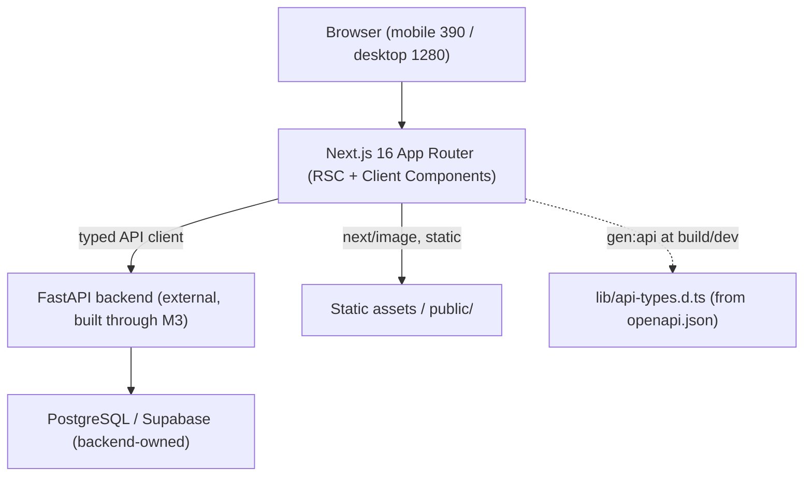
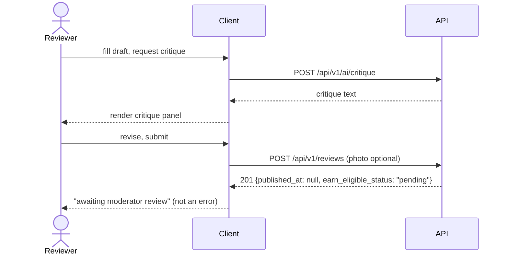

# System Design Document (SDD): Bluntly.ph Frontend

**Project:** Bluntly.ph Frontend
**Date:** 2026-07-20
**Version:** 0.1
**Owner:** Bluntly.ph frontend track
**Status:** Draft
**PRD:** [prd-bluntly-fe.md](prd-bluntly-fe.md)

---

> **Scope.** This SDD designs the **Next.js frontend** only. The FastAPI backend, its
> database schema, and its business logic are an external dependency, fixed and documented
> in [`../ARCHITECTURE_AS_BUILT.md`](../ARCHITECTURE_AS_BUILT.md), [`../schema.md`](../schema.md),
> [`../FRONTEND_INTEGRATION.md`](../FRONTEND_INTEGRATION.md), and [`../openapi.json`](../openapi.json).
> This document does not redefine backend tables or endpoints; it defines how the frontend
> consumes them. No design decision here changes backend behavior.

---

## 1. Architectural Vision & Principles

**Architecture style:** Next.js 16 App Router single-page-plus-SSR frontend that talks to one
external REST API. Stateless frontend; all durable state lives in the backend.

**Guiding principles:**
- Server-first: React Server Components render read-heavy pages; Client Components only where interactivity requires (auth forms, vote bar, review wizard, filters).
- One typed API client: every backend call goes through a single client generated from `../openapi.json`; no ad-hoc `fetch` scattered across components.
- Branch on `code`, never on message: the RFC 9457 error contract is handled in one place.
- Money is a string decimal: never coerce API money to `Number` for arithmetic.
- **This is not stock Next.js:** APIs and conventions differ from training data; read `node_modules/next/dist/docs/` before writing framework code (see BUILD).

**Key trade-offs (documented debt):**
- No refresh token (backend has none); on `401 token_expired` the app clears the session and routes to login. Accepted.
- Client-managed session token (not a backend-set httpOnly cookie) because auth is app-issued JWT via a form/JSON API; mitigations in §5.
- State libraries (Zustand, TanStack Query) are not yet installed; adding them is an FE-M1 task.

---

### 1.1 Feature realization map

Where each PRD feature is realized in this SDD (the frontend build against the backend contract).

| PRD-F# | Realized by (SDD section) |
|--------|---------------------------|
| PRD-F1 | §2 client layer + §3 nav-shell state; app shell / root layout |
| PRD-F2 | §2 RSC read page + §3 server-state cache |
| PRD-F3 | §4 auth endpoints + §5 session handling |
| PRD-F4 | §4 auth endpoints + §5 session handling |
| PRD-F5 | §4 (documented backend gap) + §5 |
| PRD-F6 | §3 server state (trust, reviews) + §4 |
| PRD-F7 | §3 query keys + §4 listing endpoints |
| PRD-F8 | §4 review/product/trust + §4.1 |
| PRD-F9 | §4.1 review + critique sequence + §8 |
| PRD-F10 | §4 seller-review endpoints |
| PRD-F11 | §4 vote endpoint + error-contract table |
| PRD-F12 | §4 `referral_redirect_url` + §5 |
| PRD-F13 | §4 (documented backend gap) |
| PRD-F14 | §3 tier from `auth/me` + §4 |
| PRD-F15 | §4 tokens balance/transactions |
| PRD-F16 | §4 requests endpoints + error contract |
| PRD-F17 | §4 payouts + §5 payout account |
| PRD-F18 | §4 contracts endpoints |
| PRD-F19 | N/A here; non-functional quality gate owned by the QAD |
| PRD-F20 | §6 infrastructure, CI/CD, deploy |

---

## 2. High-Level Architecture



**Layers:**

| Layer | Technology | Responsibility |
|-------|------------|----------------|
| Client | Next.js 16.2.10, React 19.2.4, Tailwind v4 | Render screens, handle interaction, manage session + UI state |
| Data-fetch | TanStack Query (server state) + typed API client | Fetch, cache, revalidate backend data; retries, optimistic updates |
| Client state | Zustand (or React Context for auth) | Session token, current user, transient UI (filters, wizard step) |
| API (external) | FastAPI REST, RFC 9457 errors | All persistence and business logic; not built here |
| Infrastructure | Vercel (or Node host) | Build, SSR, static hosting, preview deploys |

---

## 3. Data Architecture (client-side)

The frontend owns no database. Its "data architecture" is caching and state.

**Server state:** TanStack Query. Query keys mirror resources (`['reviews', {sort, product_id}]`,
`['review', id]`, `['tokens','balance']`, `['requests', {status, sort}]`). Defaults: stale time
30s for lists, cache time 5m; retry once except on 4xx (never retry 401/403/409/422). List
`limit` capped at 100 (backend rule). Pagination: `limit`/`offset`; moderator queue pending list
is oldest-first, everything else newest-first.

**Client state (Zustand / Context):**
- `authStore`: `{ token, user, status }`; token persisted to `localStorage` (see §5 trade-off), hydrated on load, cleared on `token_expired`.
- `uiStore`: transient filter/sort selections, open sheet, review-wizard step and draft.

**No local schema.** Types are generated, not hand-written:

```bash
npm run gen:api   # openapi-typescript docs/openapi.json -o lib/api-types.d.ts
```

Regenerate whenever the backend re-exports `openapi.json`. The app imports response/request
types from `lib/api-types.d.ts`; there is no second source of truth. Backend entities and
relationships live in [`../schema.md`](../schema.md) (25 tables); the frontend never models them
locally.

**Caching strategy:** TanStack Query in-memory cache + Next.js RSC fetch cache for public
read pages (revalidate on navigation). No service worker / offline cache in v1.

---

## 4. API Design & External Integrations

**API style:** consume an external REST API. The frontend exposes **no public API of its own**;
Next.js route handlers are used only as thin server-side proxies where a secret must not reach
the client (none required in v1, since the backend token is user-scoped).

**Contract source:** [`../openapi.json`](../openapi.json) (52 paths, 62 operations) and the
prose contract [`../FRONTEND_INTEGRATION.md`](../FRONTEND_INTEGRATION.md). The page to endpoint
map is in PRD §5.1; it is not duplicated here.

**Backend endpoints the frontend calls (by feature):**

| Feature | Method + path |
|---------|---------------|
| PRD-F3/F4 auth | `POST /api/v1/auth/register`, `POST /api/v1/auth/login` (form), `GET /api/v1/auth/me` |
| PRD-F8 review detail | `GET /api/v1/reviews/{id}`, `GET /api/v1/products/{id}`, `GET /api/v1/users/{id}/trust` |
| PRD-F7 listings | `GET /api/v1/reviews?sort=wilson\|newest`, `GET /api/v1/products`, `GET /api/v1/sellers/{id}` |
| PRD-F9 review + critique | `POST /api/v1/reviews`, `POST /api/v1/ai/critique`, `POST /api/v1/reviews/{id}/critique` |
| PRD-F10 seller review | `GET\|POST /api/v1/sellers/{id}/reviews` |
| PRD-F11 vote | `POST\|DELETE /api/v1/reviews/{id}/vote` |
| PRD-F12 affiliate | `referral_redirect_url` (`/r/{id}`) from `ReviewOut` |
| PRD-F15 tokens | `GET /api/v1/tokens/balance`, `GET /api/v1/tokens/transactions` |
| PRD-F16 requests | `GET\|POST /api/v1/requests`, `POST\|DELETE /api/v1/requests/{id}/upvote`, `POST /api/v1/requests/{id}/fulfill`, `DELETE /api/v1/requests/{id}` |
| PRD-F17 payouts | `GET /api/v1/payouts`, `PATCH /api/v1/auth/me/payout-account` |
| PRD-F18 contracts | `GET /api/v1/contracts`, `PATCH /api/v1/contracts/{id}/auto-renew`, `POST /api/v1/contracts/{id}/buyout/accept\|reject` |
| PRD-F11 admin queue | `GET /api/v1/admin/review-queue`, publish/reject/referral-link |

**The error contract (handled once).** Every error is `application/problem+json` (RFC 9457).
A single response interceptor parses it into `Problem { code, status, detail, errors?, reasons?, retry_after_seconds? }`
and the UI branches on `code`:

| code | UI behavior |
|------|-------------|
| `validation_error` (422) | map `errors[]` (`loc`,`msg`) to form fields |
| `unauthorized` / `token_expired` (401) | clear session, route to `/login` |
| `forbidden` / `role_forbidden` (403) | hide the control |
| `rate_limited` (429) | back off `retry_after_seconds`, toast |
| `cannot_vote_own_review` (409) | disable vote on own review |
| `insufficient_tokens` (409) | show balance + shortfall |
| `request_invalid` (422) | render `reasons[]` verbatim (AI screening) |
| `review_not_published` (409) | show "awaiting moderator" state |
| `seller_review_exists` (409) | "you already reviewed this seller" |
| `buyout_already_pending` (409) | refresh contract |

### 4.1 Runtime sequences

Review submission with AI critique and the publication gate (multi-step, crosses actors):



Voting is single-hop (`POST /reviews/{id}/vote` with optimistic update + reconcile).

**External integrations:**

| Service | Purpose | Rate limits / fallback |
|---------|---------|------------------------|
| Bluntly FastAPI backend | all data + auth + AI critique proxy | `429 rate_limited` → back off `retry_after_seconds`; AI critique stub degrades gracefully |
| Supabase (client) | publishable key for any client-safe reads if used | key is public-safe; no service key client-side |
| Analytics (TBD: PostHog or custom) | event taxonomy (PRD §5.6) | fire-and-forget; never blocks UI |

---

## 5. Security & Authorization

**Authentication:** app-issued **HS256 JWT** sent as `Authorization: Bearer <token>` on every
authed request. Login is an OAuth2 password form post; register is JSON. Supabase Auth is NOT
used for login (backend ADR-010/011).

**Session management:** token stored in `localStorage`, hydrated into `authStore` on load.
Expiry (`ACCESS_TOKEN_EXPIRE_MINUTES`, default 1440) is enforced by the backend; on any
`401 token_expired` the client clears the token and routes to login. No refresh token.

> **Trade-off + mitigation:** `localStorage` is chosen because the token is app-issued and used
> from the client; it is XSS-exposed. Mitigations: strict CSP, no `dangerouslySetInnerHTML` on
> user content, React auto-escaping, dependency review. If the backend later issues an httpOnly
> cookie, migrate. Documented debt.

**Authorization model:** the backend is the authority; roles are read per request
(`GET /auth/me`), so a promotion takes effect immediately. The frontend hides controls by role
(moderator-only `/admin/*`) as UX, not as a security boundary; every protected action is
enforced server-side. Never trust a role baked into a stale token.

**Data protection:**
- Secrets: only `NEXT_PUBLIC_*` values reach the client (`NEXT_PUBLIC_API_URL`, Supabase publishable key). No backend/service secrets in the frontend.
- Input validation: client-side validation for UX; the backend is the real validator (surface `errors[]`).
- Affiliate URLs: never rendered raw; only `referral_redirect_url`.
- CSP + no `eval`; user and AI-critique content is rendered as text/escaped, never executed (see §8.1).

---

## 6. Infrastructure, CI/CD & Deployment

**Hosting:** Vercel (frontend SSR + static) is the default; any Node host that runs `next start`
works. Backend is hosted separately (see [`../PRODUCTION.md`](../PRODUCTION.md)).

**Environments:**
- `dev`: `npm run dev`, `NEXT_PUBLIC_API_URL=http://localhost:8000` against the local backend (`docker compose up` in `backend/`).
- `staging`: preview deployment per PR; `NEXT_PUBLIC_API_URL` points at the staging backend; backend `CORS_ORIGINS` must include the preview origin.
- `prod`: `NEXT_PUBLIC_API_URL=https://<api host>`, backend `CORS_ORIGINS=https://app.bluntly.ph` (never `*`).

**CI/CD:** GitHub Actions: `npm ci` → `npm run gen:api` (fail if `lib/api-types.d.ts` drifts) →
`lint` → type-check → component/E2E tests (QAD) → deploy. Staging on PR, prod on tag.

**Env variables:**

```bash
NEXT_PUBLIC_API_URL=            # backend origin
NEXT_PUBLIC_SUPABASE_URL=       # existing
NEXT_PUBLIC_SUPABASE_PUBLISHABLE_KEY=  # safe client-side
```

**DR:** the frontend is stateless; recovery is a redeploy of the previous tagged build. No
frontend data store to back up (RTO: minutes via redeploy; RPO: N/A).

---

## 7. Non-Functional Requirements

| Requirement | Target | Notes |
|-------------|--------|-------|
| Route transition (p95) | < 300ms perceived | RSC streaming + skeletons; backend p95 is 73ms per `../LOADTEST_RESULTS.md` |
| First Contentful Paint (mobile, mid device) | < 2.0s | next/font self-host, image optimization |
| Lighthouse (perf / a11y) | ≥ 90 / ≥ 95 | CI budget |
| AI critique render | show loading; never blocks submit | backend stub degrades gracefully |
| Concurrent users | matches backend target (100+ verified) | frontend is stateless, scales horizontally |
| Accessibility | WCAG 2.1 AA | QAD gate (PRD-F19) |

---

## 8. AI / Agent Architecture

The frontend has **no model of its own**. The AI critique feature (PRD-F9) calls the backend
critique endpoints; the backend owns provider selection, prompting, and assurance (ADR-013).
The frontend's only responsibilities are to send the draft and render the returned critique.

**Fallback:** if critique errors or returns the no-key stub, the panel shows an informational
note and submission proceeds.

### 8.1 AI Safety & Threat Surface (frontend view)

| Risk (OWASP LLM) | Applies? | Control in the frontend | Eval (QAD) |
|------------------|----------|--------------------------|------------|
| LLM02 Insecure output handling | Yes | AI critique text and user review content are rendered as escaped text, never `dangerouslySetInnerHTML`, never executed | QAD abuse cases |
| LLM06 Sensitive-info disclosure | Partial | frontend sends only the draft fields the user typed; no secrets in the critique request | QAD |
| LLM01 Prompt injection | Backend-owned | the frontend does not construct prompts; it forwards user draft fields to a backend endpoint | N/A (backend) |

**Trust boundary:** review content, seller content, and AI critique output are all untrusted
display data; they can be shown but never drive a tool call or code execution in the client.

### 8.2 AI craft

| Craft | Answer |
|-------|--------|
| Prompt | Frontend builds no prompts; forwards draft fields to backend critique endpoint |
| Context | Only user-entered draft fields leave the client for critique |
| Harness / tools | No client tools; critique is a plain request/response |
| Loop | Single-pass request; never auto-submits the review |
| Token / cost | Owned by backend |
| Eval | QAD renders critique as text (abuse/XSS cases) |

---

## Self-Check

- [x] §2 has a diagram.
- [x] §3 adapts to a frontend (no DB); backend schema referenced, not redefined; type-generation path stated.
- [x] Every external integration has a rate-limit / fallback.
- [x] Must-Have endpoints listed and pointed at OpenAPI; the multi-actor review+critique flow has a sequence diagram; voting noted single-hop.
- [x] §5 covers auth, session, authz, and documents the localStorage trade-off + mitigations.
- [x] §7 targets are specific numbers.
- [x] §8 filled: frontend calls backend AI; no frontend AIA needed (recorded in INDEX/PRD); output-handling control stated.
- [x] V1 shortcuts documented as debt in §1 and §5.
- [x] This answers *how*, not *what* (PRD owns *what*).
